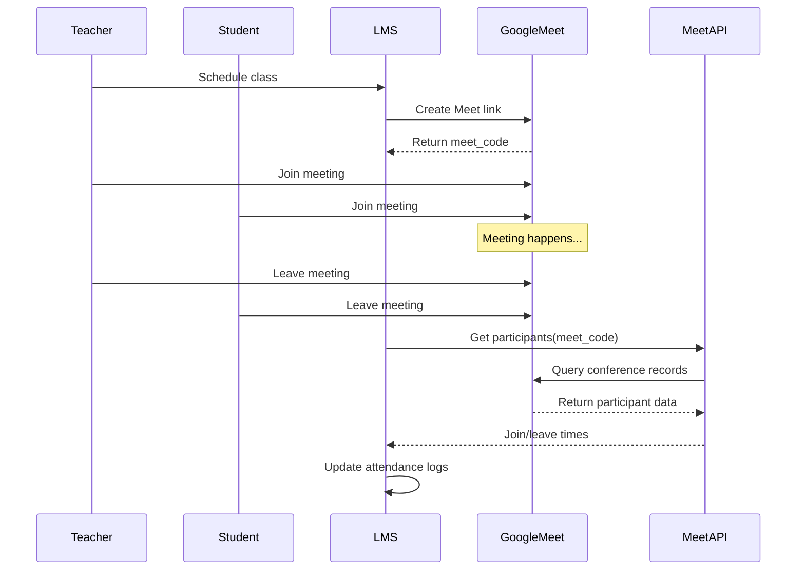

# Google Meet Participant Tracking - Updated Guide

## 🎉 GREAT NEWS!

You found the **official Google Meet REST API**! This is **MUCH BETTER** than the Reports API I initially suggested.

## Why Google Meet REST API is Better

| Feature | Meet REST API ✅ | Reports API ❌ |
|---------|-----------------|----------------|
| **Admin Required** | ❌ No | ✅ Yes (Workspace Admin) |
| **Data Availability** | ✅ Immediate after meeting | ❌ 1-24 hours delay |
| **Setup Complexity** | ✅ Simple | ❌ Complex |
| **Reliability** | ✅ Official API | ⚠️ Audit logs |
| **API Version** | ✅ v2 (Modern) | ❌ Legacy |

## Quick Setup (5 Minutes)

### Step 1: Enable Google Meet API (2 min)

1. Go to [Google Cloud Console](https://console.cloud.google.com/)
2. Select your project
3. Navigate to **APIs & Services** → **Library**
4. Search for **"Google Meet API"**
5. Click **ENABLE**

### Step 2: Authenticate with Meet Scope (2 min)

```bash
cd backend

# Delete old token
rm token.json

# Run setup with --meet flag
python setup_google_oauth.py --meet

# Browser will open - grant permissions
```

⚠️ **Important**: Use `--meet` NOT `--reports`

### Step 3: Test It!

```bash
# 1. Schedule a test meeting
POST /api/schedule/class
{
  "teacher_email": "your-email@workspace.com",
  "student_emails": ["student@email.com"],
  "subject": "Test Meeting",
  "start_time": "2026-01-16T15:00:00Z",
  "duration_minutes": 15
}

# 2. Join the meeting (both users)
# 3. Stay 2-3 minutes
# 4. Leave the meeting

# 5. Immediately sync participants (no waiting!)
POST /api/webhook/sessions/{session_id}/sync-participants
```

## API Response Example

```json
{
  "status": "success",
  "message": "Synced 2 participants",
  "updated": 0,
  "created": 2,
  "participants": [
    {
      "email": "teacher@school.com",
      "display_name": "Teacher Name",
      "total_duration_seconds": 780,
      "session_count": 1,
      "sessions": [
        {
          "start_time": "2026-01-16T15:00:23+00:00",
          "end_time": "2026-01-16T15:13:23+00:00",
          "duration_seconds": 780
        }
      ]
    },
    {
      "email": "student@school.com",
      "display_name": "Student Name",
      "total_duration_seconds": 720,
      "session_count": 1,
      "sessions": [
        {
          "start_time": "2026-01-16T15:01:15+00:00",
          "end_time": "2026-01-16T15:13:15+00:00",
          "duration_seconds": 720
        }
      ]
    }
  ]
}
```

## What You Get

✅ **Exact join/leave times** - Down to the second  
✅ **Multiple sessions** - If someone rejoins  
✅ **Total duration** - Accurate billing data  
✅ **Display names** - Who actually attended  
✅ **Immediate availability** - No 24-hour wait  
✅ **Anonymous users** - See everyone who joined  

## Technical Details

### Scope Required
```
https://www.googleapis.com/auth/meetings.space.readonly
```

### API Endpoints Used

1. **conferenceRecords.list**
   - Finds the conference record by meet code
   - Returns conference metadata

2. **conferenceRecords.participants.list**
   - Lists all participants in the conference
   - Returns participant info and timing

3. **conferenceRecords.participants.participantSessions.list**
   - Gets individual sessions for each participant
   - Returns exact join/leave times

### Files Created

✅ `backend/app/services/google_meet_api.py` - New Meet API service  
✅ Updated `backend/app/routers/webhook.py` - Uses Meet API  
✅ Updated `backend/setup_google_oauth.py` - Added --meet flag  

## How It Works



## Troubleshooting

### "Meet API not enabled"
→ Enable **Google Meet API** in Cloud Console (not Admin SDK)

### "Invalid credentials" or "Insufficient permissions"
→ Delete `token.json` and re-run: `python setup_google_oauth.py --meet`

### "No conference record found"
→ Meeting hasn't been created yet  
→ Double-check the `meet_code` is correct  
→ Make sure at least one person joined

### "Conference record exists but no participants"
→ Meeting was created but no one joined yet  
→ Wait a few seconds after meeting ends

## Comparison with Old Method

### ❌ Old Method (Reports API)
```python
# Required Admin SDK API
# Needed Workspace Admin
# Data delayed 1-24 hours
# Complex setup

reports_service.get_meeting_participants(
    meet_code="abc-defg-hij",
    start_time=datetime(...),
    end_time=datetime(...)
)
```

### ✅ New Method (Meet REST API)
```python
# Uses Google Meet API
# No admin required
# Data available immediately
# Simple setup

meet_service.get_meeting_participants(
    meet_code="abc-defg-hij"
)
```

## Migration Notes

If you already set up the Reports API:

1. **No need to remove it** - Both can coexist
2. **Meet API is preferred** - Faster and simpler
3. **Re-authenticate** with `--meet` flag
4. **Test the new endpoint** - Same URL works

The webhook endpoint automatically uses the new Meet API service.

## Next Steps

1. ✅ Enable Google Meet API in Cloud Console
2. ✅ Run: `python setup_google_oauth.py --meet`
3. ✅ Schedule and join a test meeting
4. ✅ Call the sync endpoint immediately after
5. ✅ See real participant data! 🎉

## Documentation Links

- [Google Meet API Overview](https://developers.google.com/workspace/meet/api/guides/overview)
- [Conference Records API](https://developers.google.com/workspace/meet/api/reference/rest/v2/conferenceRecords)
- [Participants API](https://developers.google.com/workspace/meet/api/reference/rest/v2/conferenceRecords.participants)
- [Participant Sessions API](https://developers.google.com/workspace/meet/api/reference/rest/v2/conferenceRecords.participants.participantSessions)
